# SmartEdu – Refactored Use Case Diagram

## 1. Identified Actors

| # | Actor | Description |
|---|-------|-------------|
| 1 | Student | A learner who enrolls in courses, consumes learning materials, takes quizzes/exams, and interacts with the AI Tutor and forum. |
| 2 | Instructor | An educator who creates and manages courses, uploads content, builds question banks, grades essays, monitors student progress, and participates in the forum. |
| 3 | Administrator | A platform operator who manages user accounts, reviews instructor profiles, moderates content, handles financial transactions, and monitors system statistics. |
| 4 | AI System | An intelligent subsystem that recommends learning paths, auto-grades quizzes, analyzes learning data, provides AI Tutor responses, and performs exam proctoring. |
| 5 | Payment Gateway | An external payment service integrated for processing student tuition payments. |

## 2. Identified Use Cases

| # | Use Case | Module | Description |
|---|----------|--------|-------------|
| 1 | Log In | Authentication | Authenticate and access the system |
| 2 | Manage Personal Profile | Authentication | View and update personal information |
| 3 | Search Courses | Enrollment & Payment | Search and browse available courses |
| 4 | Recommend Learning Path | Enrollment & Payment | AI suggests courses based on search history, skills, and career goals |
| 5 | Register for Course | Enrollment & Payment | Enroll in a selected course |
| 6 | Pay Tuition | Enrollment & Payment | Process tuition payment through the payment gateway |
| 7 | Watch Lecture Videos | Learning | View course video content |
| 8 | Download Documents | Learning | Download course materials and documents |
| 9 | Take Quiz | Learning | Complete multiple-choice quizzes during a course |
| 10 | Interact with AI Tutor | Learning | Ask questions and receive basic AI-generated answers |
| 11 | Participate in Forum | Learning | Post and discuss topics with instructors and other students |
| 12 | Create and Manage Course | Course Management | Create courses, upload videos, write documents, and configure course settings |
| 13 | Manage Question Bank | Course Management | Create, edit, and organize test questions |
| 14 | Track Student Progress | Course Management | Monitor individual student learning progress and engagement |
| 15 | Auto-Grade Quiz | Course Management | AI automatically grades multiple-choice quizzes |
| 16 | Analyze Learning Data | Course Management | AI analyzes skipped videos and frequently wrong answers to provide insights |
| 17 | Grade Essay | Course Management | Manually evaluate and score student essay submissions |
| 18 | Take Final Exam | Examination & Proctoring | Complete a proctored final examination |
| 19 | Proctor Exam with AI | Examination & Proctoring | AI monitors webcam/microphone for cheating behaviors during exams |
| 20 | Report Violation | Examination & Proctoring | AI records cheating logs, warns the student, and sends violation reports |
| 21 | Manage User Accounts | Platform Administration | Create, update, disable, or delete user accounts |
| 22 | Review Instructor Profile | Platform Administration | Approve or reject new instructor applications before they can create courses |
| 23 | Moderate Content | Platform Administration | Remove copyright-violating courses or inappropriate forum posts |
| 24 | Manage Financial Transactions | Platform Administration | Review tuition revenue, calculate commissions, and process instructor payouts |
| 25 | Track System Statistics | Platform Administration | Monitor active students, user engagement, and system stability |

## 3. Refactored Use Case Diagram (Mermaid)

```mermaid
flowchart TD

    %% ===== LEFT-SIDE ACTORS =====
    Student(("Student"))
    Instructor(("Instructor"))

    %% ===== RIGHT-SIDE ACTORS =====
    Admin(("Administrator"))
    AI(("AI System"))
    PG(("Payment Gateway"))

    %% ===== SYSTEM BOUNDARY =====
    subgraph SmartEdu["SmartEdu System"]

        subgraph Auth["Authentication"]
            UC1([Log In])
            UC2([Manage Personal Profile])
        end

        subgraph Enrollment["Enrollment & Payment"]
            UC3([Search Courses])
            UC4([Recommend Learning Path])
            UC5([Register for Course])
            UC6([Pay Tuition])
        end

        subgraph Learning["Learning"]
            UC7([Watch Lecture Videos])
            UC8([Download Documents])
            UC9([Take Quiz])
            UC10([Interact with AI Tutor])
            UC11([Participate in Forum])
        end

        subgraph CourseMgmt["Course Management"]
            UC12([Create and Manage Course])
            UC13([Manage Question Bank])
            UC14([Track Student Progress])
            UC15([Auto-Grade Quiz])
            UC16([Analyze Learning Data])
            UC17([Grade Essay])
        end

        subgraph Exam["Examination & Proctoring"]
            UC18([Take Final Exam])
            UC19([Proctor Exam with AI])
            UC20([Report Violation])
        end

        subgraph PlatformAdmin["Platform Administration"]
            UC21([Manage User Accounts])
            UC22([Review Instructor Profile])
            UC23([Moderate Content])
            UC24([Manage Financial Transactions])
            UC25([Track System Statistics])
        end

    end

    %% ===== STUDENT CONNECTIONS =====
    Student --> UC1
    Student --> UC2
    Student --> UC3
    Student --> UC4
    Student --> UC5
    Student --> UC6
    Student --> UC7
    Student --> UC8
    Student --> UC9
    Student --> UC10
    Student --> UC11
    Student --> UC18
    Student --> UC20

    %% ===== INSTRUCTOR CONNECTIONS =====
    Instructor --> UC1
    Instructor --> UC2
    Instructor --> UC11
    Instructor --> UC12
    Instructor --> UC13
    Instructor --> UC14
    Instructor --> UC15
    Instructor --> UC16
    Instructor --> UC17
    Instructor --> UC20

    %% ===== ADMINISTRATOR CONNECTIONS =====
    Admin --> UC1
    Admin --> UC20
    Admin --> UC21
    Admin --> UC22
    Admin --> UC23
    Admin --> UC24
    Admin --> UC25

    %% ===== AI SYSTEM CONNECTIONS =====
    AI --> UC4
    AI --> UC10
    AI --> UC15
    AI --> UC16
    AI --> UC19
    AI --> UC20

    %% ===== PAYMENT GATEWAY CONNECTION =====
    PG --> UC6

    %% ===== RELATIONSHIPS =====
    UC18 -.->|"<<include>>"| UC19
```

## 4. Improvements Made

### Layout changed to vertical (Top-Down)
- Switched from a flat unstructured `graph TD` to `flowchart TD` with clearly defined subgraphs, producing a clean top-down flow where actors sit at the top and use cases cascade downward inside the system boundary.

### Line crossing reduced
- **Grouped all connections by actor** instead of interleaving them. Each actor's connections are declared as a contiguous block, allowing Mermaid's layout engine to minimize edge crossings.
- **Actors are logically split**: Student and Instructor (high-interaction actors) are positioned on the left side; Administrator, AI System, and Payment Gateway (lower-interaction or external actors) are on the right side, reducing long crossing lines.

### Use cases grouped for readability
- 25 use cases organized into **6 logical modules** inside the system boundary:
  - **Authentication** (2) — shared entry point for all human actors
  - **Enrollment & Payment** (4) — course discovery through payment
  - **Learning** (5) — active learning activities
  - **Course Management** (6) — instructor-side content and grading
  - **Examination & Proctoring** (3) — exams, AI proctoring, violation handling
  - **Platform Administration** (5) — admin-only governance functions
- This modular grouping makes it immediately clear which functional area each use case belongs to and which actors interact with each module.

### UML best practices applied
- Used **rounded rectangle nodes** `([...])` for use cases (closer to UML oval convention).
- Used **circle nodes** `(("..."))` for actors (standard UML stick-figure placeholder).
- Wrapped all use cases inside a **system boundary** subgraph named "SmartEdu System".
- Preserved the `<<include>>` relationship between Take Final Exam and Proctor Exam with AI using a dashed arrow.
